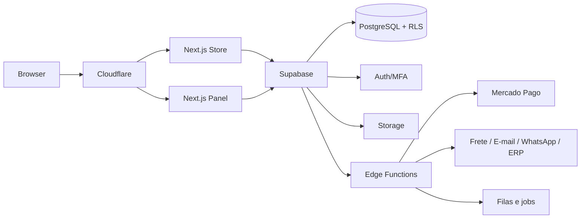

# Arquitetura

Loja e painel possuem bundles separados. Server Components entregam conteúdo público cacheável; páginas autenticadas são privadas e `no-store`. O domínio usa centavos, UTC e contratos independentes de provider.
